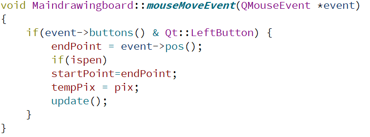

# MY Qt Drawing Board Project
This project may not look so perfect(It does not have a lot of extended functions), because I have to prepare for the final project while dealing with this project.Please don't care.  

# The main UI about my drawing board.  

## About the *extra function* of my drawing board and its implementation  
1. Having a Qaction to see about this program(designer)  
Implementation:Create a new Dialog without Buttons and add a slot function to the QAction to show this new Dialog which contents something About Designer. It has a picture and a hyperlink.  
  
 
2. Having the SAVE function.  
Implementation:Use the member function save of class QPixmap object.The graffiti files will be saved in the project root directory as PNG.  
  

3. Having the OPEN function.  
Implementation:Use the member funtion load of class QPixmap object.Then use the member funtion scale to adjust the size of picture you want to open.  
  

1. Having the eraser function.
Implementation:In fact, the eraser is just another large white pen.Create a slot funtion and set the Qpen is OK.  
  

## Some technical details
1. Using resource system.  
Implementation: Add a new class named Qt resource file. Then add your files into the folder. When you want to use some files ,you can just only by using :/name .  

2. Add Qmenu to the QTool button,and add QAction to the QTool.  
Implementation:Create QMenu, QAction class objects, and use their member functions.  

    
 
3. Like the previous project, I used Qsignalmapper to connect the signal to the slot function.  
Implementation:First connect the Qaction-triggered event with the map() in signalmapper,then use setmapping function. At last connect the map with slot function.  
  
4. The change line color and change line width funtion.
Implementation:Both them are same as the change shape and fill color funtion.I just need to write the corresponding slot function to change Qpen or the QBrush's property.Sometime I should also judge their property in the paintevent funtion.  
    

5. Draw a graphic.  
Implementation:Draw with double-buffers.I will use two maps,a temp pixmap and the realpixmap.I will first draw the content onto tempPix, then draw tempPix onto the interface.The readpixmap will save the picture I have already finished.When I release the mouse to complete the drawing of the graphic, copy the contents of tempPix to the readpixmap.  

6. Drawing graffiti.
Implementation:Use the mouse click, move, release event well.Graffiti is like a lot of straight lines.So I should to update startpoint in the event of mouse movement,then draw a line between startpoint and the endpoint.  
  
  
  

## The problems I meet and solve.
1. Failed to open a .png file by using the relative path.
The reason is that I did't put the file in the resource folder.    
Solve:Use this function: QDir::setCurrent(app.applicationDirPath()) 
2. Faild to use the resource system.  
Solve:The path is incorrect,change it to the right path.
3. Painting with Qpainter does not display lines.(QWidget::paintEngine: Should no longer be called
QPainter::begin: Paint device returned engine == 0, type: 1)  
The reason is that I use Qpainter in the constructor function.The class object has not been created yet.  So I can just only use it in its member function.  
4. Why is the member function PaintEvent() executed without a call?   
Reason:The function PaintEvent() executes when building the class object it belongs to.
5. Prompt error: QPainter::setPen: Painter not active  
Reason:The QPainter object calls setpen() before its begin() function. So I just put the function between the begin() and the end().
6. I used QBrush but no fill effect.  
Reason:The default style is Qt :: NoBrush, so I should define the fill style first.

### Reference  
 >[阿里巴巴矢量图标库](https://www.iconfont.cn/)
 >[Qt学习二、添加资源文件](https://www.cnblogs.com/wangcb/p/6642510.html)  
 >[关于Qt Creater中资源文件和文件路径的记录](https://blog.csdn.net/yanlutian/article/details/78181508)  
 >[qt中的菜单QMenu QAction](https://blog.csdn.net/swartz_lubel/article/details/54985130)  
 >[pushbutton文字在图片正下方](https://bbs.csdn.net/topics/390117534)  
 >[QPaintEvent原理](https://blog.csdn.net/u010002704/article/details/39062033)  
 >[QT关键问题解决之paintevent理解](https://blog.csdn.net/u012151242/article/details/78947024)  
 >[Qt 2D绘图之一：基本图形绘制和渐变填充](https://www.cnblogs.com/linuxAndMcu/p/11057347.html)  
 >[qt控件绘图](https://bbs.csdn.net/topics/390478197)
